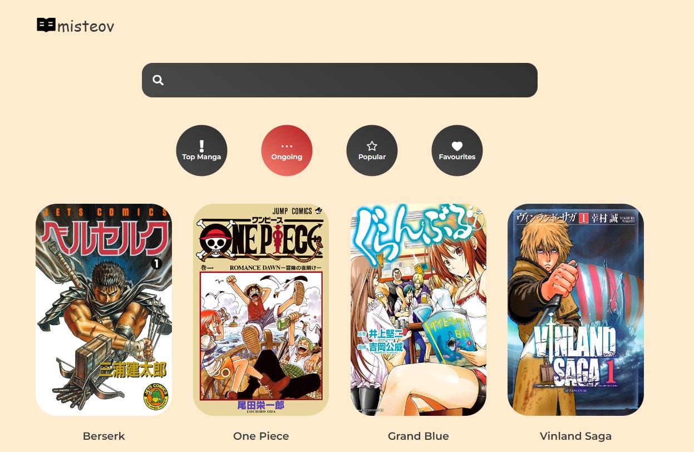
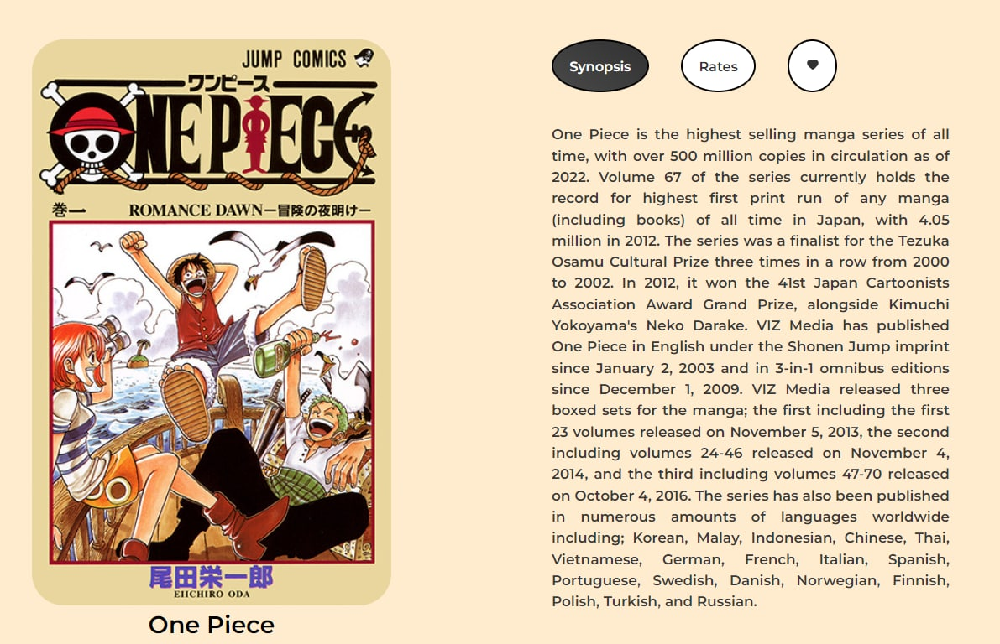
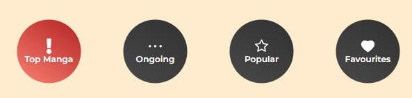
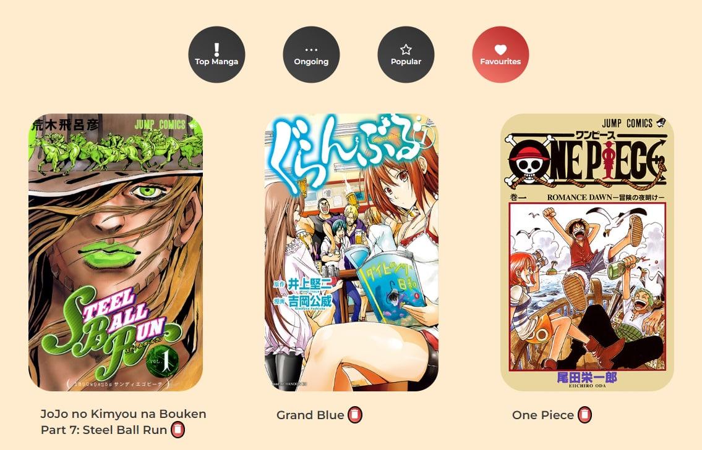

<h1 align="center">Misteov: Manga Tracker</h1>
<h2 align="center"><a href="https://github.com/gabdulova">Salim Binazir</a>
<a href="https://github.com/DanaOtelbay?">Otelbay Dana</a></h2>
<h2 align="center">Project for INFT3139 JS Framework: React</h2>



## Description
Manga tracker app for your favourite manga on React JS. 

## Project requirements:
1. At least 4 pages - ✔️
2. Components, Props - ✔️
3. Components, State - ✔️
4. Lifecycle methods - ✔️
5. API Requests - ✔️

<a  href="https://docs.api.jikan.moe/"> Jikan (時間) </a> is an open-source PHP & REST API for the “most active online anime + manga community and database” — MyAnimeList.net. It parses the website to satisfy the need for an API. 

6. Hooks - ✔️
7. Navigation - ✔️
8. Context System - ✔️

## How to use
- **Click** on the image or manga title, then you will be referred to the page with details of this manga.
- **Click** on the synopsis/rate buttons - information will be displayed on the same page.
- **Click** on the 💗 and the manga will be added to the favourite list of current user. 
- **Click** on the categories that are on navigation bar and then the page with the catalog of this category will be opened.
- **Click** on the Favorites category and only manga added by current user will be displayed.
- **Click** on the 🗑️ and the manga will be deleted from the favourite list of current user.
- **Click** on the search bar and type whatever you want, and the search results will show up. (P.s. there is some troubles with explicit genres, so some R-rated manga will show up as well.)




## Project setup
```
npm install
npm i framer-motion react-icons react-router-dom styled-components
npm start
```
## Future scope

- Add other categories and personal lists for users, authorization.
